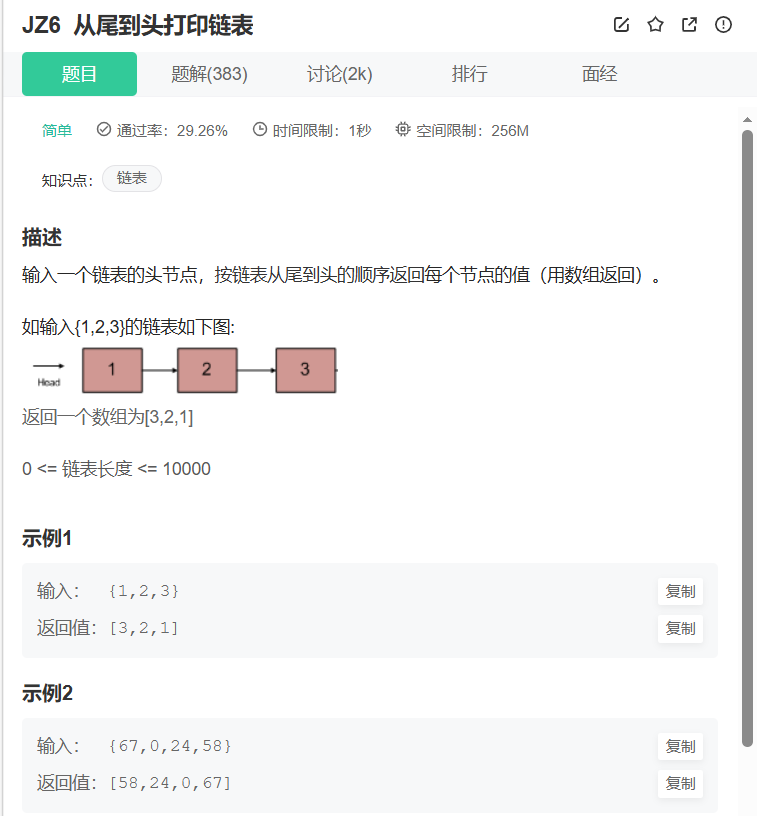

```cpp
/**
*  struct ListNode {
*        int val;
*        struct ListNode *next;
*        ListNode(int x) :
*              val(x), next(NULL) {
*        }
*  };
*/
#include <algorithm>
#include <cstdlib>
#include <iterator>
#include <vector>
class Solution {
public:
    vector<int> printListFromTailToHead(ListNode* head) {
        vector<int> answer;
        while(head)
        {
            answer.push_back(head->val);
            head = head->next;
        }
        std::reverse(answer.begin(), answer.end());
        return answer;
    }
};
``` 
