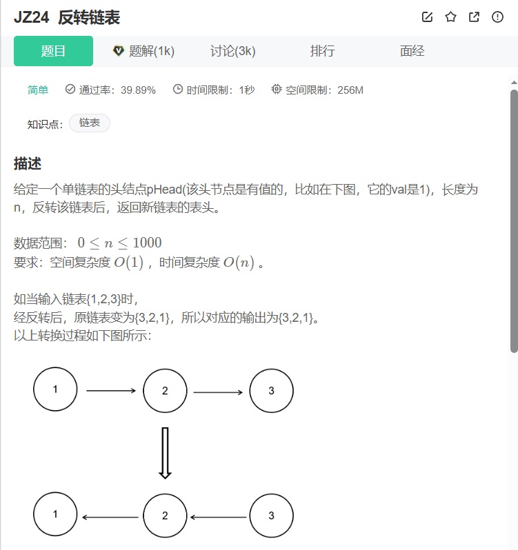
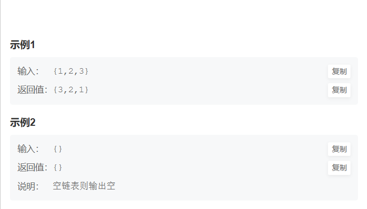

```cpp
/**
 * struct ListNode {
 *	int val;
 *	struct ListNode *next;
 *	ListNode(int x) : val(x), next(nullptr) {}
 * };
 */
#include <cstdlib>
class Solution {
public:
    /**
     * 代码中的类名、方法名、参数名已经指定，请勿修改，直接返回方法规定的值即可
     *
     * 
     * @param head ListNode类 
     * @return ListNode类
     */
    ListNode* ReverseList(ListNode* head) {
        ListNode* pre = nullptr;
        ListNode* next = nullptr;
        while(head)
        {
            next = head->next;
            head->next = pre;
            pre = head;
            head = next;
        }


        return pre;
    }
};
```
