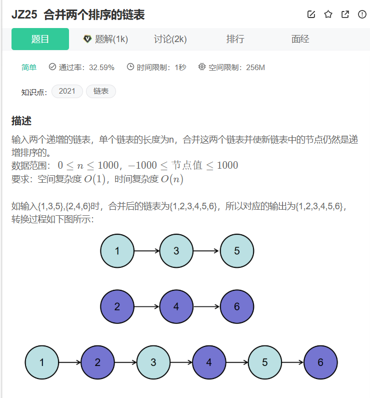
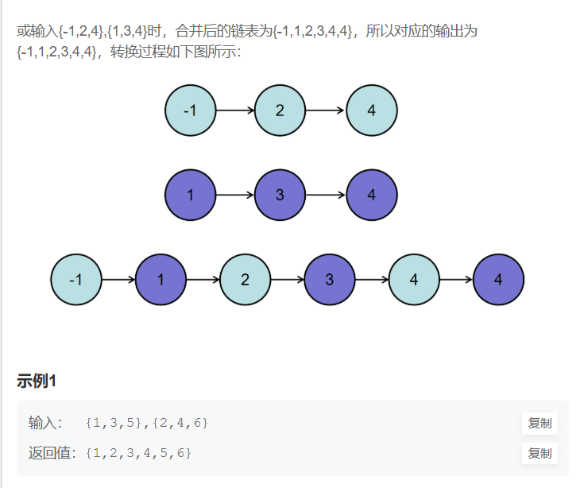
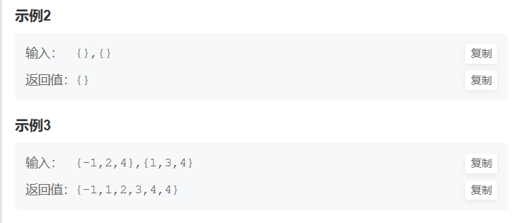

```cpp
/**
 * struct ListNode {
 *	int val;
 *	struct ListNode *next;
 *	ListNode(int x) : val(x), next(nullptr) {}
 * };
 */
#include <bits/types/struct_tm.h>
class Solution {
public:
    /**
     * 代码中的类名、方法名、参数名已经指定，请勿修改，直接返回方法规定的值即可
     *
     * 
     * @param pHead1 ListNode类 
     * @param pHead2 ListNode类 
     * @return ListNode类
     */
    ListNode* Merge(ListNode* pHead1, ListNode* pHead2) {
        ListNode* ans = new ListNode(0);
        ListNode* ans_copy = ans;
        
        while(pHead1 != nullptr && pHead2 != nullptr)
        {
            if(pHead1->val < pHead2->val)
            {
                ans->next = pHead1;
                ans = pHead1;
                pHead1 = pHead1->next;
            }
            else
            {
                ans->next = pHead2;
                ans = pHead2;
                pHead2 = pHead2->next;
            }
        }
        if(pHead1 == nullptr && pHead2 != nullptr)
        {
            ans->next = pHead2;
        }
        else if(pHead1 != nullptr && pHead2 == nullptr)
        {
            ans->next = pHead1;
        }
        ListNode* realHead = ans_copy->next;
        delete ans_copy;
        return realHead;

    }


};
```
