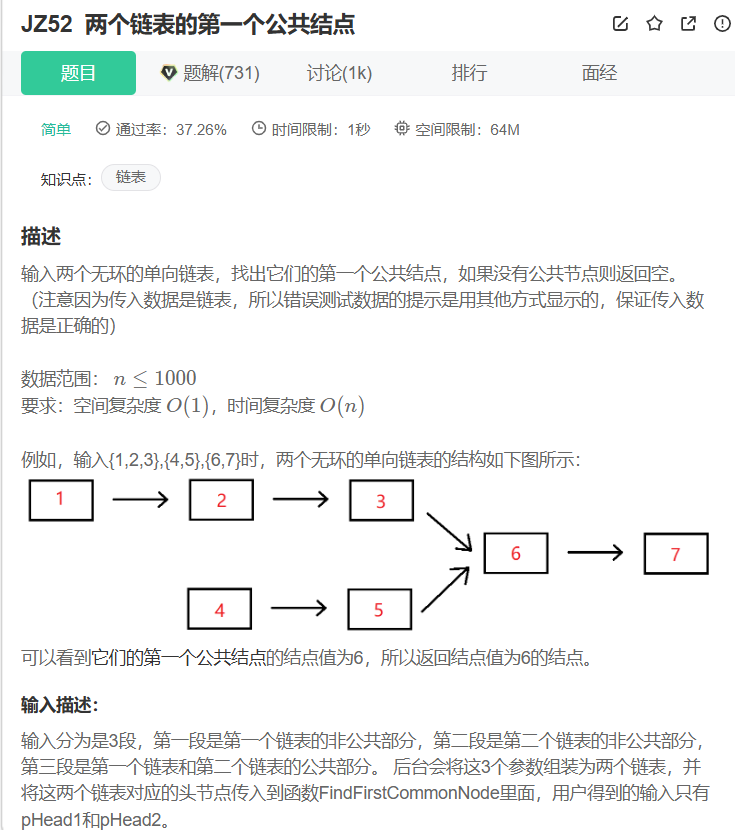
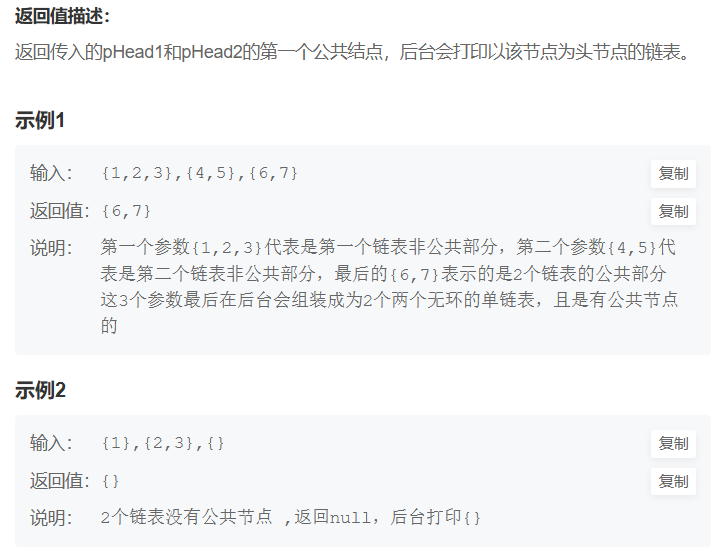

```cpp
/*
struct ListNode {
	int val;
	struct ListNode *next;
	ListNode(int x) :
			val(x), next(NULL) {
	}
};*/
class Solution {
public:
    ListNode* FindFirstCommonNode( ListNode* pHead1, ListNode* pHead2) {
        ListNode* pHead1Dummy = pHead1;
		ListNode* pHead2Dummy = pHead2;

		//分别测量两个链表的长度
		while(pHead1Dummy != nullptr && pHead2Dummy != nullptr)
		{
			pHead1Dummy = pHead1Dummy->next;
			pHead2Dummy = pHead2Dummy->next;
		}
		//让长的先走diffrence
		while(pHead1Dummy != nullptr)
		{
			pHead1 = pHead1->next;
			pHead1Dummy = pHead1Dummy->next;
		}
		while(pHead2Dummy != nullptr)
		{
			pHead2 = pHead2->next;
			pHead2Dummy = pHead2Dummy->next;
		}
		//一起走
		while(pHead1 != nullptr && pHead2 != nullptr)
		{
			//判断有没有公共节点
			if(pHead1 == pHead2)
			{
				return pHead1;
			}
			pHead1 = pHead1->next;
			pHead2 = pHead2->next;
		}
		
		
		return pHead1;
    }
};

```
