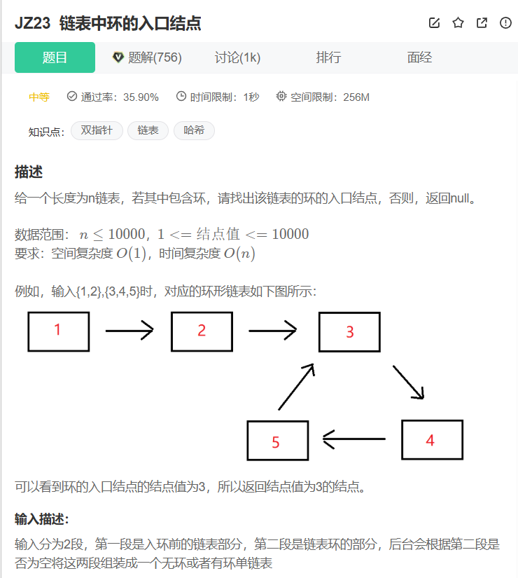
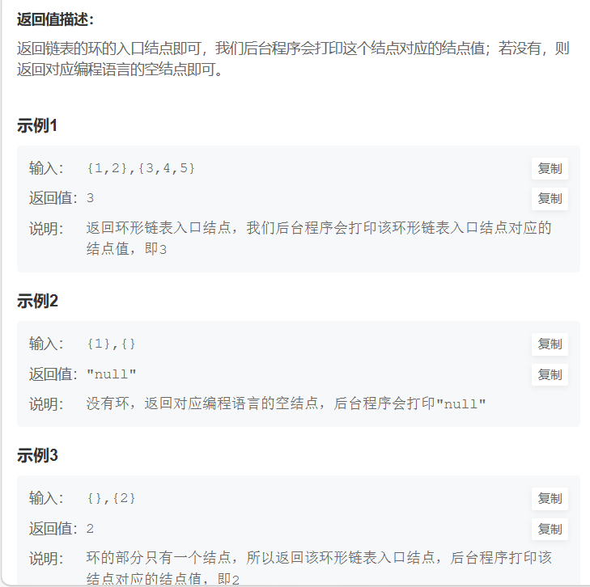

```cpp

/*
struct ListNode {
    int val;
    struct ListNode *next;
    ListNode(int x) :
        val(x), next(NULL) {
    }
};
*/
#include <cmath>
class Solution {
  public:
    ListNode* EntryNodeOfLoop(ListNode* pHead) {
        /*  //创建一个dummy指针，一个map
          ListNode* slowptr = pHead;
          std::map<ListNode*, int> myMap;
          if(slowptr == nullptr) return nullptr;
          while(slowptr)
          {
              if(myMap.count(slowptr) == 0) myMap[slowptr] = 1;
              else myMap[slowptr]++;
              if(myMap[slowptr] == 2) return slowptr;
              slowptr = slowptr->next;
          }
          return nullptr;
          */
        ListNode* fast = pHead;
        ListNode* slow = pHead;
        int flag = 0;
        if (pHead == nullptr) return nullptr;

        while(fast != nullptr && fast->next != nullptr)
        {
            slow = slow->next;
            fast = fast->next->next;
            if(fast == slow)
            {
                flag = 1;
                break;
            }
        }
        if(flag == 0)
        {
            return nullptr;
        }
        else
        {
            slow = pHead;
            while(slow != fast)
            {
                fast = fast->next;
                slow = slow->next;
            }
            return fast;
        }
    }
};
```