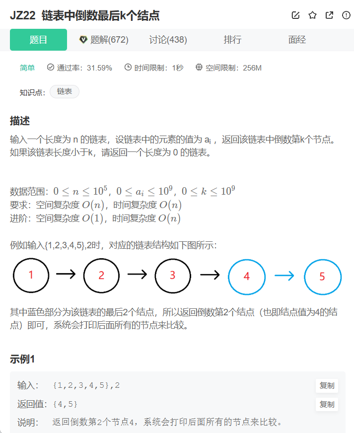
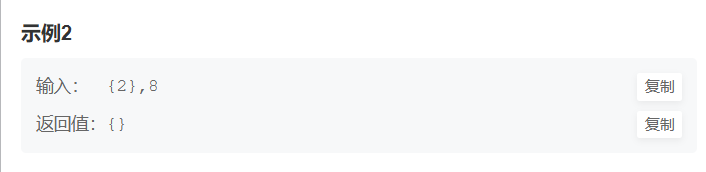

```cpp
/**
 * struct ListNode {
 *	int val;
 *	struct ListNode *next;
 *	ListNode(int x) : val(x), next(nullptr) {}
 * };
 */
class Solution {
public:
    /**
     * 代码中的类名、方法名、参数名已经指定，请勿修改，直接返回方法规定的值即可
     *
     * 
     * @param pHead ListNode类 
     * @param k int整型 
     * @return ListNode类
     */
    ListNode* FindKthToTail(ListNode* pHead, int k) {
        //双指针
        ListNode* head = pHead;
        ListNode* tail = pHead;
        //快的指针先走k步，如果走的过程中就变成了nullptr，证明k大于链表长度
        while(k)
        {
            if(!head) return nullptr;
            head = head->next;
            k--;
        }
        //快的和慢的一起走，快的编程nullptr的时候，慢的指的就是倒数第k给节点
        while(head)
        {
            head = head->next;
            tail = tail->next;
        }
        return tail;
    }
};
```