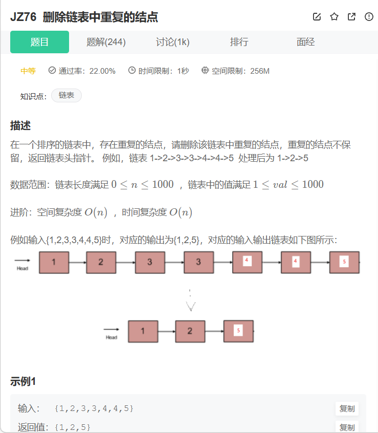
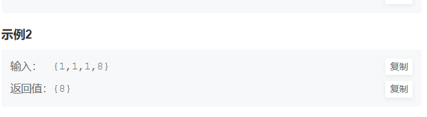

```cpp

/*
struct ListNode {
    int val;
    struct ListNode *next;
    ListNode(int x) :
        val(x), next(NULL) {
    }
};
*/
class Solution {
public:
    ListNode* deleteDuplication(ListNode* pHead) {
        if (pHead == nullptr) return nullptr;
        ListNode* cur = pHead;
        //创建一个哑节点作为链表新的头节点，这样就可以把之前头节点的特殊情况
        //转换为非头节点普通情况
        ListNode* dummy = new ListNode(0);
        dummy->next = pHead;
        ListNode* pre  = dummy;
        while(cur) {
            //找到重复的段的头部
            if(cur->next != nullptr && cur->val == cur->next->val) {
                ListNode* start = cur;
                //找到重复段的尾部
                while (cur->next != nullptr && cur->val == cur->next->val) {
                    cur = cur->next;
                }
                //删除重复的节点
                while (start != cur) {
                    ListNode* tmp = start->next;
                    delete start;
                    start = tmp;
                }
                pre->next = cur->next;
                cur = pre->next;
                //删除重复段的最后一个节点
                delete start;

            } else {
                pre = cur;
                cur = cur->next;
            }

        }
        ListNode* newHead = dummy->next;
        delete dummy;
        return newHead;
    }
};
```