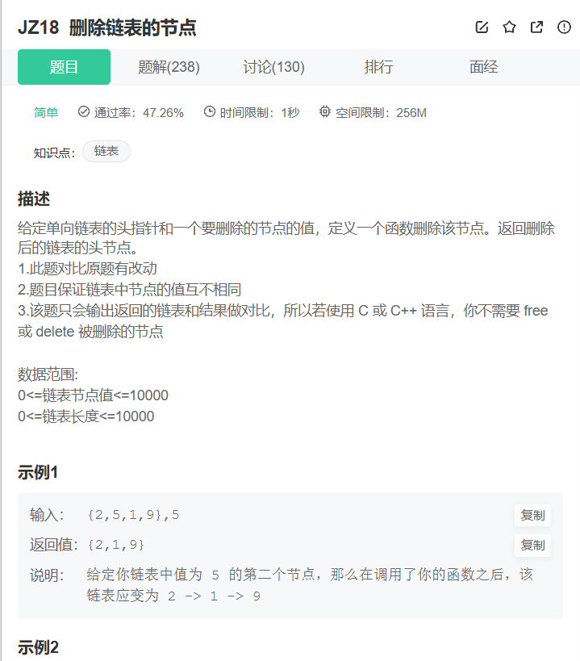
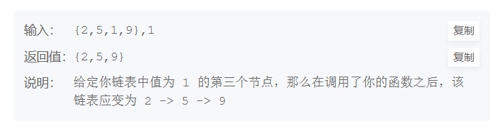

```cpp
/**
 * struct ListNode {
 *	int val;
 *	struct ListNode *next;
 *	ListNode(int x) : val(x), next(nullptr) {}
 * };
 */
class Solution {
public:
    /**
     * 代码中的类名、方法名、参数名已经指定，请勿修改，直接返回方法规定的值即可
     *
     * 
     * @param head ListNode类 
     * @param val int整型 
     * @return ListNode类
     */
    ListNode* deleteNode(ListNode* head, int val) {
        ListNode* dummy = head;
        ListNode* pre = nullptr;
        ListNode* next = nullptr;
        if(!dummy) return nullptr;
        if(dummy->val == val) return dummy->next;
        while(dummy)
        {

            if(dummy->val == val)
            {
                //删除该节点并设置flag为1证明成功删除
                next = dummy->next;
                pre->next = next;
                return head;
                
            }
            else
            {
                pre = dummy;
                dummy = dummy->next;
            }
            
        }
        //如果flag为0证明删除失败(未实现)
        return head;
    }
};
```